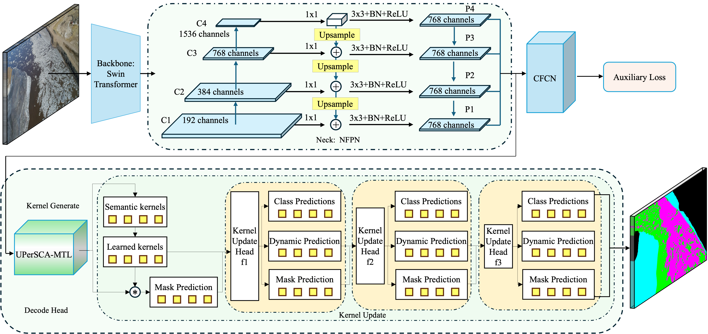

# IceSegNet: A Stage-Aware Dynamic Kernel Network for River Ice Segmentation in Remote Sensing Imagery

<div align="center">

[](https://www.sciencedirect.com/science/article/pii/S1568494625014334)
[](https://github.com/fox-4869/IceSegNet)
[](https://github.com/open-mmlab/mmsegmentation)
[](LICENSE)

**English** | [中文](README_CN.md)

</div>

> **IceSegNet: A stage-aware dynamic kernel network for river ice segmentation in remote sensing imagery**
>
> Kaijun Wu, Dingju Zhou\*, Juanjuan Du, Yuelian Wu, Lidong Zhang
>
> *Applied Soft Computing, Vol. 186, 2026* | [📄 Paper](https://www.sciencedirect.com/science/article/pii/S1568494625014334)

---

## 🏔️ Highlights

- 🎯 **Stage-Aware Kernel Update Module** — Three structurally distinct stages (detail preservation → transition stabilization → semantic purification) with progressively reduced feedforward widths (2048 → 1024 → 512), cutting FFN parameters by **41.7%** while improving mIoU by **0.96%**.
- 🧠 **UPerSCA-MTL Decode Head** — Unified Perceptual Parsing enhanced with Spatial Cross-Attention (SCA) and Multi-Task Learning (MTL) for joint semantic segmentation and edge detection.
- 🏆 **State-of-the-Art Results** — **93.81% mIoU** on NWPU_YRCC2 (+1.19% over K-Net, +1.31% over Mask2Former); **93.56% mIoU** on NWPU_YRCC_EX (+0.43% over K-Net).

---

## 📋 Abstract

Accurate segmentation of river ice in remote sensing imagery is critical for quantifying ice coverage—a key variable in early warning and risk assessment of ice-jam disasters. IceSegNet addresses the challenges of large-scale variation, spectral similarity between ice and water, and ambiguous boundaries through two core innovations:

1. A **stage-aware kernel update module** that refines features through three structurally distinct stages with progressively reduced hidden widths.
2. **UPerSCA-MTL**, a multi-task decoding head that fuses spatial cross-attention and edge detection to enhance boundary accuracy.

Evaluated on two Yellow River ice datasets — NWPU_YRCC2 (1525 images, 4 classes) and NWPU_YRCC_EX (887 images, 3 classes) — IceSegNet achieves state-of-the-art performance among 18 competing segmentation models.

---

## 🏗️ Architecture



### Stage-Aware Kernel Update

| Stage | Role | FFN Hidden Width |
|-------|------|-----------------|
| I | Detail Preservation — retains fine texture and edge cues | 2048 |
| II | Transition Stabilization — bridges low-level detail to semantics | 1024 |
| III | Semantic Purification — compact class-discriminative embeddings | 512 |

### UPerSCA-MTL Head

- **PPM**: Multi-scale context aggregation via pyramid pooling
- **SCA (Spatial Cross-Attention)**: Horizontal + vertical global pooling to capture axis-specific directional dependencies, enhancing ambiguous ice–water boundary delineation
- **Depthwise Separable Convolutions**: Reduce computational complexity without sacrificing feature quality
- **Multi-Task Head**: Parallel segmentation + edge detection branches; edge supervision derived automatically from GT mask gradients (no extra annotation needed)

---

## 📊 Main Results

### NWPU_YRCC2 (4 classes: Land / Water / Shore Ice / Drift Ice)

| Method | Venue | mIoU (%) | PA (%) | mFscore (%) | FPS | Params (M) |
|--------|-------|----------|--------|-------------|-----|------------|
| U-Net | MICCAI 2015 | 61.62 | 80.59 | 75.55 | 3.05 | 29 |
| PSPNet | CVPR 2017 | 90.70 | 94.28 | 95.07 | 9.41 | 47 |
| DeepLabv3+ | ECCV 2018 | 90.37 | 94.74 | 94.92 | 5.42 | 60 |
| SegFormer | NeurIPS 2021 | 86.99 | 92.61 | 92.98 | 4.18 | 82 |
| Mask2Former | CVPR 2022 | 92.50 | 96.12 | 96.09 | 3.75 | 216 |
| DINOv2+Rein | CVPR 2025 | 89.86 | 94.01 | 94.63 | 2.21 | 317 |
| K-Net *(baseline)* | NeurIPS 2021 | 92.62 | 95.78 | 96.15 | 3.58 | 245 |
| **IceSegNet *(Ours)*** | ASOC 2025 | **93.81** | **96.31** | **96.79** | 3.43 | 247 |

### NWPU_YRCC_EX (3 classes: Ice / Water / Other)

| Method | mIoU (%) | PA (%) | mFscore (%) |
|--------|----------|--------|-------------|
| PSPNet | 85.42 | 92.54 | 92.13 |
| DeepLabv3+ | 88.04 | 93.93 | 93.63 |
| Mask2Former | 93.26 | 96.56 | 96.50 |
| K-Net *(baseline)* | 93.13 | 96.49 | 96.43 |
| **IceSegNet *(Ours)*** | **93.56** | **96.73** | **96.67** |

---

## ⚙️ Installation

### Requirements

- Python ≥ 3.8
- PyTorch ≥ 1.12 with CUDA
- MMEngine, MMCV ≥ 2.0, MMSegmentation

### Step-by-Step Setup

**1. Create and activate conda environment**

```bash
conda create -n icesegnet python=3.8 -y
conda activate icesegnet
```

**2. Install PyTorch** (example: CUDA 11.6)

```bash
pip install torch==1.12.1+cu116 torchvision==0.13.1+cu116 \
    --extra-index-url https://download.pytorch.org/whl/cu116
```

**3. Install MMEngine and MMCV**

```bash
pip install -U openmim
mim install mmengine
mim install "mmcv>=2.0.0"
```

**4. Install MMSegmentation**

```bash
git clone https://github.com/open-mmlab/mmsegmentation.git
cd mmsegmentation
pip install -v -e .
cd ..
```

**5. Clone this repository**

```bash
git clone https://github.com/fox-4869/IceSegNet.git
cd IceSegNet
pip install -r requirements.txt
```

---

## 📁 Data Preparation

Download the datasets:

- **NWPU_YRCC2**: [https://github.com/nwpulab113/NWPUYRCC2](https://github.com/nwpulab113/NWPUYRCC2)
- **NWPU_YRCC_EX**: [https://github.com/nwpulab113/NWPUYRCCEX](https://github.com/nwpulab113/NWPUYRCCEX)

Organize the directory as follows:

```
data/
├── NWPU_YRCC2_JPG1/
│   ├── train/             # Training images (.jpg)
│   ├── train_labels/      # Training annotations (.png)
│   ├── val/               # Validation images
│   └── val_labels/        # Validation annotations
└── NWPU_YRCC_EX/
    ├── train/
    ├── train_labels/
    ├── val/
    └── val_labels/
```

### Register Custom Modules

**1. Copy dataset definitions**

```bash
cp datasets/NWPU_YRCC2_JPG1.py mmsegmentation/mmseg/datasets/
cp datasets/NWPU_YRCC.py       mmsegmentation/mmseg/datasets/
```

Add to `mmseg/datasets/__init__.py`:

```python
from .NWPU_YRCC2_JPG1 import NWPU_YRCC2_JPG1
from .NWPU_YRCC import NWPU_YRCC
```

**2. Copy model components**

```bash
cp models/sefpn.py             mmsegmentation/mmseg/models/necks/
cp models/uper_att_plus_head.py mmsegmentation/mmseg/models/decode_heads/
```

Register in the corresponding `__init__.py` files under `mmseg/models/necks/` and `mmseg/models/decode_heads/`.

---

## 🚀 Training

**Single GPU**

```bash
python tools/train.py configs/icesegnet-config.py
```

**Multi-GPU** (recommended — paper uses 2× RTX 3090)

```bash
bash tools/dist_train.sh configs/icesegnet-config.py 2
```

Key training settings:

| Hyperparameter | Value |
|---------------|-------|
| Optimizer | AdamW (β₁=0.9, β₂=0.999) |
| Learning Rate | 6×10⁻⁵ |
| Weight Decay | 5×10⁻⁴ |
| Batch Size | 4/GPU × 2 GPUs = 8 total |
| Max Iterations | 60,000 |
| LR Schedule | Linear warmup (500 iters) + CosineAnnealing |
| Crop Size | 512 × 512 |
| Backbone Init | ImageNet-22K pretrained Swin-L |

---

## 🧪 Evaluation

**Standard evaluation**

```bash
python tools/test.py configs/icesegnet-config.py /path/to/checkpoint.pth
```

**With Test-Time Augmentation (multi-scale + flip)**

```bash
python tools/test.py configs/icesegnet-config.py /path/to/checkpoint.pth --tta
```

Reported metrics: **mIoU**, **mDice**, **mFscore**, **PA**, **BFscore**

---

## 📂 Repository Structure

```
IceSegNet/
├── configs/
│   └── icesegnet-config.py        # Full training & evaluation config
├── datasets/
│   ├── NWPU_YRCC2_JPG1.py         # 4-class dataset (Land/Water/Shore Ice/Drift Ice)
│   └── NWPU_YRCC.py               # 3-class dataset (Others/Water/Shore Ice)
├── models/
│   ├── sefpn.py                   # SEFPN neck with BN+ReLU normalization
│   └── uper_att_plus_head.py      # UPerSCA-MTL decode head
├── tools/                         # Training & testing scripts (MMSeg)
├── README.md                      # English README
├── README_CN.md                   # Chinese README
└── requirements.txt
```

---

## 📖 Citation

If IceSegNet is helpful for your research, please cite:

```bibtex
@article{wu2026icesegnet,
  title     = {IceSegNet: A stage-aware dynamic kernel network for river ice
               segmentation in remote sensing imagery},
  author    = {Wu, Kaijun and Zhou, Dingju and Du, Juanjuan and
               Wu, Yuelian and Zhang, Lidong},
  journal   = {Applied Soft Computing},
  volume    = {186},
  pages     = {114120},
  year      = {2026},
  publisher = {Elsevier},
  doi       = {10.1016/j.asoc.2025.114120}
}
```

---

## 🙏 Acknowledgements

This work was supported by the Natural Science Foundation Key Project of Gansu Province (23JRRA860), the Inner Mongolia Key R&D and Achievement Transformation Project (2023YFSH0043, 2023YFDZ0043, 2023YFDZ0054), the Key Research and Development Project of Lanzhou Jiaotong University (ZDYF2304), and the Excellent Graduate Student "Innovation Star" Project of Gansu Province (2025CXZX-682).

This codebase is built on [MMSegmentation](https://github.com/open-mmlab/mmsegmentation). We also thank the authors of [K-Net](https://github.com/ZwwWayne/K-Net) for the foundational dynamic kernel framework.

---

## 📬 Contact

**Corresponding Author**: Dingju Zhou — [dingjuzhou@163.com](mailto:dingjuzhou@163.com)

Lanzhou Jiaotong University, Lanzhou 730070, China
